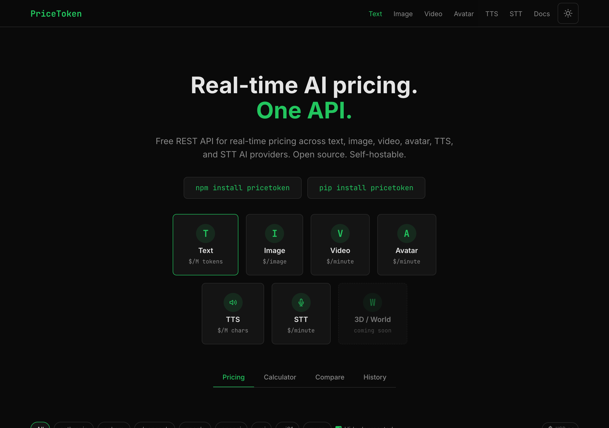
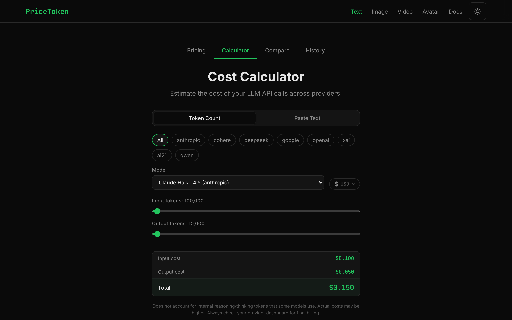
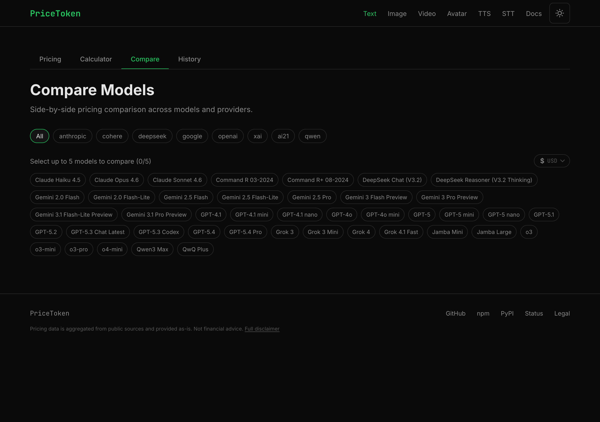
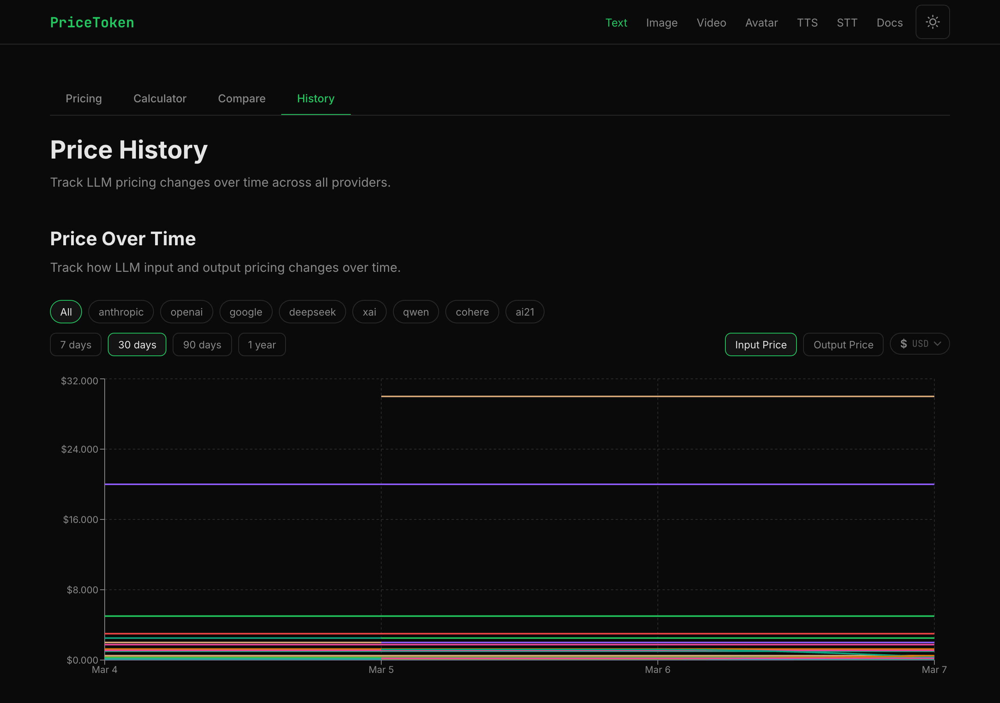
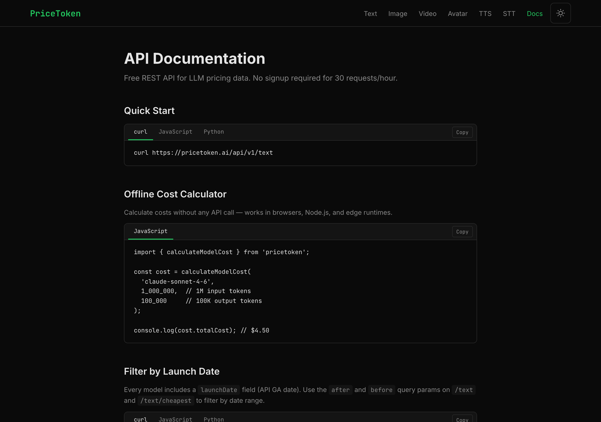

# PriceToken

Real-time LLM pricing data. One API.

<!-- Badge visible when repo is public or when viewing on GitHub while authenticated -->
[](https://github.com/affromero/pricetoken/actions/workflows/ci.yml)
[](https://www.npmjs.com/package/pricetoken)
[](https://opensource.org/licenses/MIT)

Free REST API for real-time pricing data across OpenAI, Anthropic, Google, and more. Open source, self-hostable.



## Quick Start

### npm Package

```bash
npm install pricetoken
```

```typescript
import { PriceTokenClient, calculateModelCost } from 'pricetoken';

// Fetch live pricing
const client = new PriceTokenClient();
const pricing = await client.getPricing();

// Calculate cost (offline — no API call)
const cost = calculateModelCost('claude-sonnet-4-6', 1_000_000, 100_000);
console.log(cost.totalCost); // $4.50
```

### REST API

```bash
# All models
curl https://pricetoken.ai/api/v1/pricing

# Single model
curl https://pricetoken.ai/api/v1/pricing/claude-sonnet-4-6

# Price history
curl https://pricetoken.ai/api/v1/pricing/history?days=30

# Compare models
curl https://pricetoken.ai/api/v1/pricing/compare?models=claude-sonnet-4-6,gpt-4.1

# Cheapest model
curl https://pricetoken.ai/api/v1/pricing/cheapest
```

## API Reference

| Endpoint | Description |
|----------|-------------|
| `GET /api/v1/pricing` | Current pricing. `?provider=anthropic` |
| `GET /api/v1/pricing/:modelId` | Single model |
| `GET /api/v1/pricing/history` | Historical data. `?days=30&modelId=x&provider=y` |
| `GET /api/v1/pricing/providers` | Provider list with stats |
| `GET /api/v1/pricing/compare` | Compare models. `?models=a,b,c` |
| `GET /api/v1/pricing/cheapest` | Cheapest model. `?provider=x` |

### Rate Limits

- **No API key**: 30 requests/hour
- **With API key**: 500 requests/hour

Rate limit headers: `X-RateLimit-Limit`, `X-RateLimit-Remaining`, `X-RateLimit-Reset`.

## Self-Hosting

### Prerequisites

- Node.js 22+
- PostgreSQL 16+
- Redis 7+
- AI API key — Anthropic, OpenAI, or Google (for price scraping)

### Development

```bash
git clone https://github.com/affromero/pricetoken.git
cd pricetoken
npm install
docker compose up -d
npx prisma db push --schema=apps/web/prisma/schema.prisma
npx prisma generate --schema=apps/web/prisma/schema.prisma
npm run dev
```

### Production (Docker)

```bash
cp .env.example .env  # Configure DATABASE_URL, REDIS_URL, ANTHROPIC_API_KEY
docker compose -f docker-compose.prod.yml up -d
```

## Screenshots

| Cost Calculator | Compare Models |
|:---:|:---:|
|  |  |

| Price History | API Docs |
|:---:|:---:|
|  |  |

## Architecture

```
Provider pricing pages → Daily cron (AI extraction) → PostgreSQL snapshots
                         ↓
         Next.js API routes ← Redis cache (5min TTL)
                         ↓
              npm package (typed client)
```

## Alternatives

| Project | What it does | Differentiator |
|---------|-------------|----------------|
| [LiteLLM](https://github.com/BerriAI/litellm) | Proxy + SDK with cost tracking | Unified API gateway, 100+ providers |
| [pricepertoken.com](https://pricepertoken.com) | Web UI with daily pricing updates | Clean comparison interface |
| [LLM Price Check](https://llmpricecheck.com) | Side-by-side cost calculator | Visual cost comparison tool |
| [Helicone](https://helicone.ai/llm-cost) | Observability platform + pricing | Production monitoring + cost tracking |
| [Artificial Analysis](https://artificialanalysis.ai) | Benchmarks + pricing data | Performance benchmarks alongside pricing |
| [tokencost](https://github.com/AgentOps-AI/tokencost) | Python cost estimation library | Python-native, AgentOps integration |
| [llm-prices](https://github.com/simonw/llm-prices) | JSON pricing data | Raw data, minimal tooling |

PriceToken focuses on being a **real-time API** — scraped daily from provider pages, served via REST with Redis caching, and distributed as a zero-dependency npm package with offline cost calculation.

## Disclaimer

Pricing data is provided on a best-effort basis and may be inaccurate, incomplete, or outdated. LLM providers change prices without notice, and our scraping pipeline may not capture every change immediately.

**This data is for informational purposes only. Do not use it as the sole basis for financial decisions.** Always verify pricing directly with the provider before committing to spend.

If you get a bill you weren't expecting, that's between you and your provider — not us. See the [MIT License](LICENSE) under which this project is distributed (specifically the "AS IS" and "NO WARRANTY" clauses).

Found incorrect pricing? [Open an issue](https://github.com/affromero/pricetoken/issues).

## License

MIT
